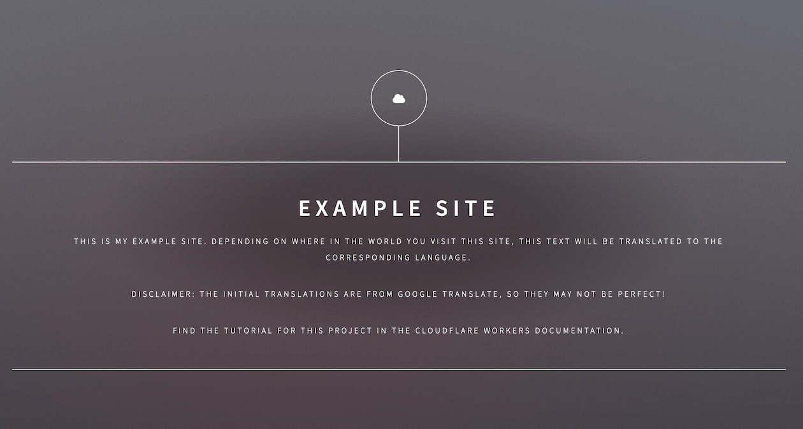

# Localization with Workers and HTMLRewriter - Static Site

This is the static site for the [Cloudflare Workers](https://workers.cloudflare.com) ["Localize a Website" tutorial](https://developers.cloudflare.com/workers/tutorials/localize-a-website/), which shows how to use the HTMLRewriter API in Cloudflare Workers to dynamically translate a website (this repository) based on a user's location.

This site should be deployed (using something like [GitHub Pages](https://github.com/pages), or [Netlify](https://netlify.com)), and added as a domain to [Cloudflare](https://cloudflare.com).

The accompanying codebase for the Workers side of this tutorial can be found at [signalnerve/i18n-example-workers](https://github.com/signalnerve/i18n-example-workers).

The design for this site is based on [Dimension by HTML5 UP](https://html5up.net), by @ajlkn.
